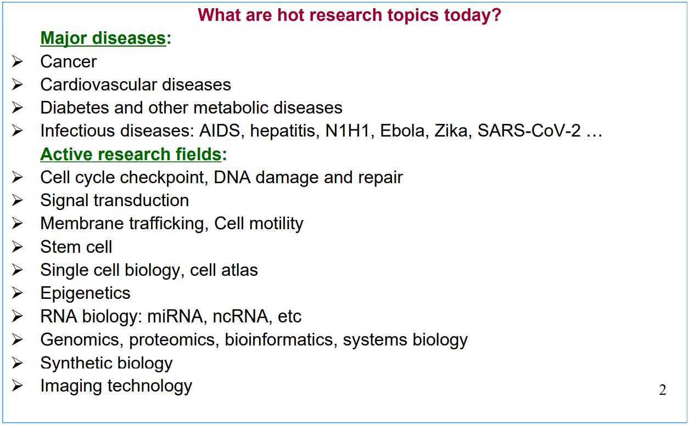
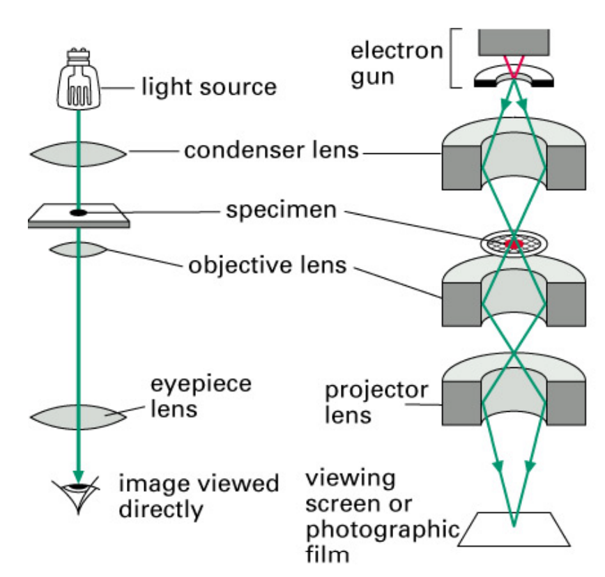
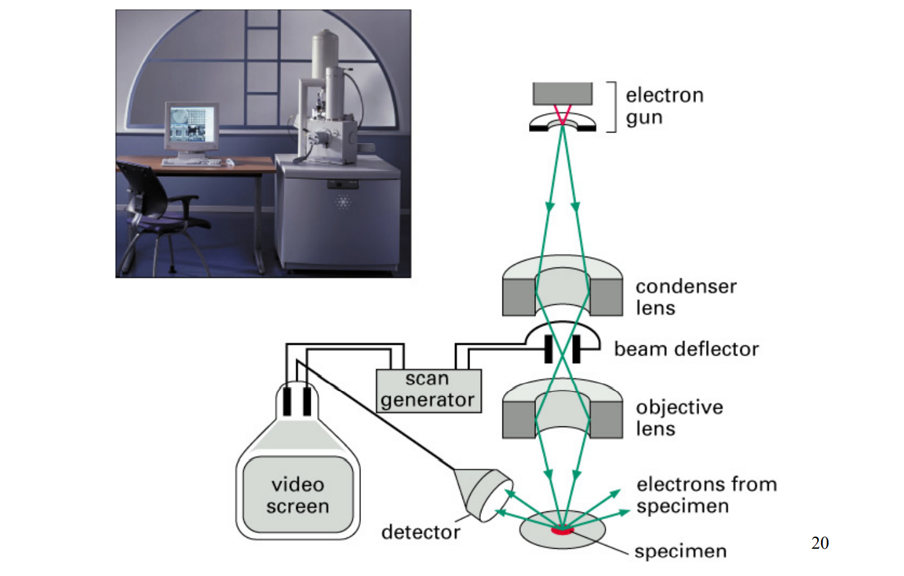
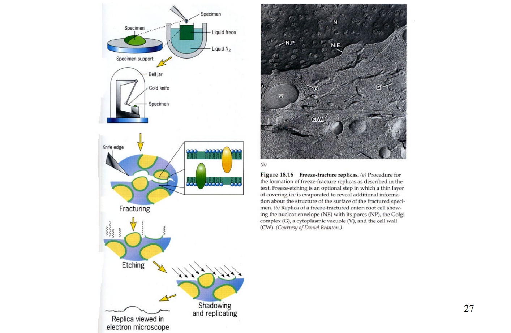
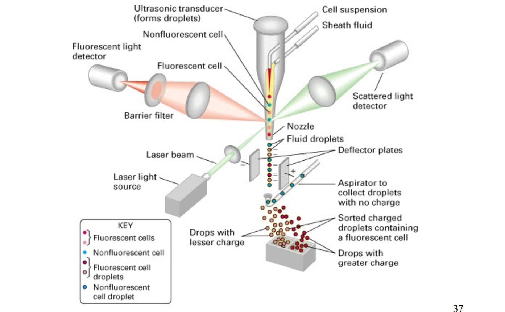
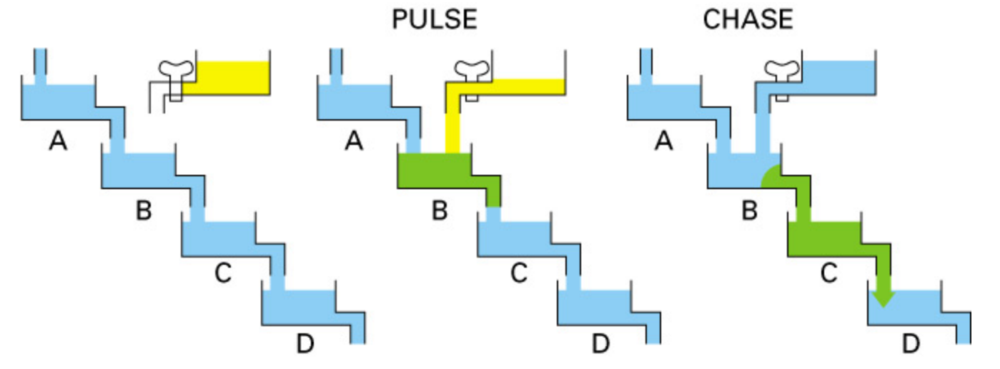
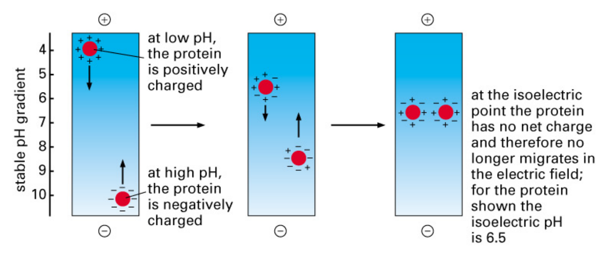
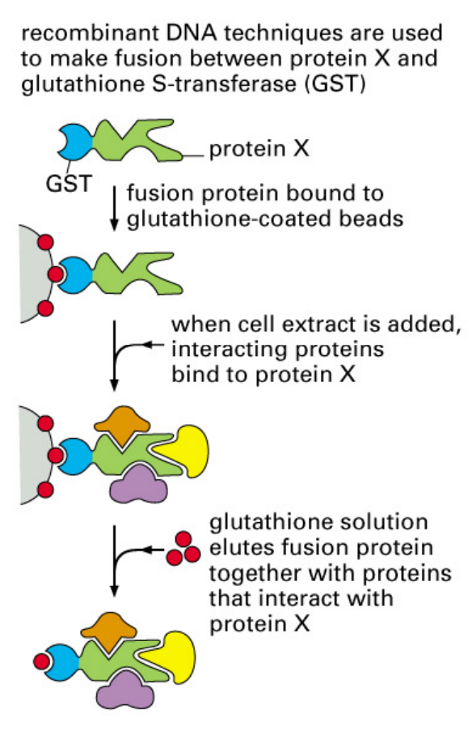

# 9/14 第一周
## 课前介绍
open office hour 不容错过

成绩分配：   
课堂测验20%  四到六次
文献研讨10%
期中考试20%  随堂考
期末考试50%

教科书：
细胞生物学(第五版) 丁
Molecular Biology of the Cell (7th) Alberts B et al

分块儿：1~6\7~10\11~14

细胞生物学强调的是结构，以及对应的功能如何实现。强调的是结构和功能的协调。

How to learn cell biology?
Understand instead of remember, until you can describe it with your own words.
定义要掌握清楚，这是基础。
特别强调要理解结构以及功能，and more importantly their coordination.
听课、课后及时阅读参考书、回顾课件。听课是最重要的。

# Ch 1 Introduction
#### Overview
1. About Cell Biology
2. Cell Theory
3. Cells are the basic units of life
4. The basic properties of cells
5. The cell size
6. Prokaryotic and eukaryotic cells
7. Prokaryotes
8. Viruses
9. Evolution of eukaryotic cells

#### 1.About Cell Biology

#### 2. Cell Theory
细胞数量级在10μm，细菌在1μm

**The three basic tenets of the Cell Theory**:
All organisms are composed of one or more cells.
The cell is the structural unit of life.
Cells can arise only by division from a preexisting cell.

#### 3. Cells are the basic units of life
**Why are cells the basic units of life?**:
A. The cell is the structural unit of life: All organisms are made up of cells.
B. The cell is the functional unit of organisms:All metabolic activities are based on a cell.
C. The cell is the foundation of reproduction, and the bridge of inheritance.
D. The cell is the growing and developing basis of the life.
E. Cells are totipotent and can create a new organism of the same type.

#### 4. The basic properties of cells
⚫ Cells are highly complex and organized, and generate and degrade numerous molecules and structures
⚫ Cells possess a genetic program and the means to use it
⚫ Cells are capable of producing more of themselves
⚫ Cells can acquire and utilize energy
⚫ Cells carry out a variety of chemical reactions and engages in numerous mechanical activities such as shape change and movement
⚫ Cells are able to respond to stimuli, sense and send information
⚫ Cells are capable of self-regulation, regulate their gene expression to meet changing needs
⚫ Cells die from aggravated assault or an internal program

#### 5. The cell size
#### 6. Prokaryotic and eukaryotic cells
**Two fundamentally different classes of cells: prokaryotes and eukaryotes**

A. Prokaryotic and eukaryotic cells are distinguished by the size and the types of internal structures, or organelles, especially whether there is the nuclear envelope.

B. Characteristics that distinguish prokaryotic and eukaryotic cells
    (1) Complexity: Prokaryotes are relatively simple, whereas eukaryotes are more complex in structure and function
    (2) Genetic material: All cells store their hereditary information in the same liner chemical code (DNA), but in different way of packaging, different amount and different form.
    (3) Cytoplasm: Eukaryotes have membrane-boundorganelles and cytoskeletal proteins; prokaryoteshave neither. Both have ribosomes, but they differ insize.
    (4) Cellular reproduction: Eukaryotes divide by mitosis;prokaryotes divide by simple fission.
    (5) Locomotion: Eukaryotes use both cytoplasmicmovement and cilia and flagella; prokaryotes have flagella, but they differ in both form and mechanismfrom eukaryotic flagella

#### 7. Prokaryotes
#### 8. Viruses
#### 9. Evolution of eukaryotic cells

# Ch 2 Methods in Cell Biology
#### Overview
1. Cell culture and cell engineering
2. Light microscopy
3. Electron microscopy
4. Fluorescence probes
5. Isotope application
6. Cell fractionation
7. Protein science
8. Protein-protein interaction
9. Molecular biology and genetics methods

#### 1. Cell culture and cell engineering
cell culture:细胞培养
制备单克隆抗体

# 9.21 第二周

#### 2. Light microscopy
1. 荧光显微镜：Fluorescence Microscopy
原理：一些物质在吸收高频光后会发射低频光，可以照高频光然后看它发的低频光

2. 激光共聚焦显微镜：confocal fluorescence microscopy
原理：用的是激光，看到的是很窄的一个面上的东西，分辨率更高，能到200nm，还可以做三维重建

3. Indirect immunocytochemistry:

#### 3. Electron microscopy
1. 透视电镜:Transmission EM

看切片
2. 扫描电镜:Scanning EM
看表面

需要特殊处理让电子束不能穿透
3. 冷冻蚀刻:Freeze-etching
把样品冻到液氮里，用刀把膜结构等切开，然后扫描电镜看膜表面等的特殊结构

4. 免疫胶体金:Immunogold

除了用金颗粒标记以外还可以酶学标记，产生电子密度更大的区域
#### 4. Fluorescence probes（荧光探针）
1. aequorin：根据荧光分子改造出来的探针蛋白，可以响应Ca2+
2. fura-2：也可以感受钙离子发出荧光
3. GFP：

4. FACS(Fluroescence-activated cell sorter):流式细胞仪

#### 5. Isotope application
1. Isotope probes：同位素探针
2. Pulse-chase：脉冲追踪

#### 6. Cell fractionation
最难的技术之一：细胞分级分离
1. 差速离心：

2. 速度离心Velocity sedimentation：用某种介质，把样品放在介质里，样品在介质中移动速度不同
3. equilibrium sedimentation

#### 7. Protein science
1. 柱层析Column chromatography可以用来分离蛋白和buffer
2. 凝胶层析gel-filtration用来分离不同大小的蛋白
3. 离子交换层析ion-exchange chromatography可以分离电性不同的蛋白，最后用盐溶液洗下来
4. 亲和层析affinity chromatography亲和层析，如果用抗体做亲和可以用酸洗下来或者高浓度的抗原肽段
5. SDS-page：破坏结构，把蛋白变成线性的；让蛋白带上负电，保证往正极跑
6. 等电点聚焦：蛋白质在不同pH下电性不同，利用这点分离

7. immunoblotting：
8. 质谱法Mass-spectrometry：
#### 8. Protein-protein interaction

1. GST pull down:

2. co-IP(co-immunoprecipitation):
3. 酵母双杂交:yeast two-hybride
把DNA-binding domain、

4. FRET(fluorescence resonance energy transfer)：如果发绿光说明有相互作用

5. Phage display:
需要用很大的短肽的库来筛
6. Biacore:
#### 9. Molecular biology and genetics methods
1. site-directed mutagenesis:
引物变一个位点pcr然后扩增出来的没有甲基化，用识别甲基化的酶就可以把未突变的原质粒干掉

2.  Introducing a membrane-impermeant substance into a cell：

3. knockdown：让基因沉默：shRNA、siRNA
siRNA和RNA结合就让它水解了，就敲低表达了
shRNA不是直接加而是加质粒让它自己表达出来敲低
4. knockout and addition
5. LoxP-cre system
6. CRISPR/CAS9

