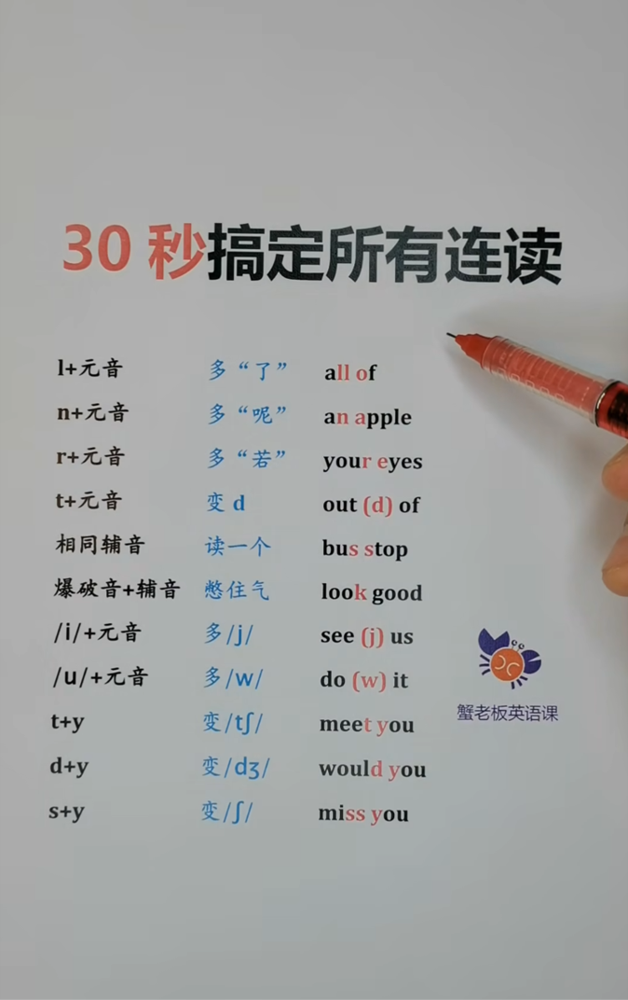

### week 0 

1. aversive odor               (厌恶的气味)
2. cas·cade       /kæˈskeɪd/     (n.信息的连续传递过程)
3. ap·pend·age     /əˈpendɪdʒ/   (n.附肢)
4. dis·tal    /ˈdɪstl/            (adj.末梢的;远端的)
5. sensillum      /senˈsɪləm/       (n.感受器)
6. Drosophila melanogaster     (黑腹果蝇)
7. solitary species            (独居物种)
8. col·lect·ive     /kəˈlektɪv/     (adj.集体的)
9. dis·pers·al     /dɪˈspɜːsl/       (n.疏散;扩散)
10. con·text        /ˈkɒntekst/     (n.背景;环境;语境)
11. pla·nar    /ˈpleɪnər/        (adj.平面的;二维的)
12. trial     /ˈtraɪəl/              (n.试验)
13. tra·jec·tory         /trəˈdʒektəri/         (n.轨迹)
14. sche·mat·ic        /skiːˈmætɪk/       (n.示意图;原理图)
15. reso·lution      /ˌrezəˈluːʃn/    (n.分辨率;解决办法)
16. stimu·lus        /ˈstɪmjələs/            (n.刺激)
17. elicit        /iˈlɪsɪt/         (v.引起)
18. gui                 (n.图形用户界面)
19. tu·tor·ial      /tjuːˈtɔːriəl/  (n.教程;指南)
20. spe·cify       /ˈspesɪfaɪ/      (v.详细说明)
21. plugin      /plʌgɪn/        (n.插件)
22. exe·cute    /ˈeksɪkjuːt/    (v.执行)
23. inter·face          (n.界面)
24. grey·scale          (adj.灰度的)
25. argument            (n.参数)
26. index               (n.索引;指标)
27. device              (n.设备)
28. frame               (n.帧)
29. ini·tial·ize     /ɪˈnɪʃəlaɪz/   (v.初始化) 
30. op·er·ation     /ˌɒpəˈreɪʃn/    (n.操作)
31. pixel    /ˈpɪksl/       (n.像素)
32. merge    /mɜːdʒ/        (v.使合并)
33. co·ord·in·ate /kəʊˈɔːdɪnət/     (n.坐标)
34. in·ten·sity    /ɪnˈtensəti/     (n.强度)
35. bitwise                 (adj.逐位)
36. morphological           (adj.形态学的)
37. erosion /ɪˈrəʊʒ(ə)n/    (n.侵蚀)
38. default         (adj.默认的)
39. sole·ly    /ˈsəʊlli/    (adj.仅)
40. snip·pet    /ˈsnɪpɪt/   (n.一小条（消息）;一小段（谈话、音乐等）)
41. dilation   /daɪˈleɪʃn/     (v.扩张)
42. ar·bi·trary    /ˈɑːbɪtrəri/     (adj.任意的)
### week 1
1. ethic           (n.道德学；伦理学；道德准则)
2. ob·li·ga·tion       (n.义务)
3. ecosophy = ecological philosophy = (n.生态哲学)
4. humanity        (n.人性;人文)
5. cri·sis         (n.危机)
6. hol·is·tic    /həʊˈlɪstɪk/    (adj.整体的)
7. con·struct  /kənˈstrʌkt/    (v.组成;修建  n.概念)
8. totipotent              (adj.全能的)
9. elu·sive    /iˈluːsɪv/  (adj.难找的;难以解释的)
### week 2
1. lysosomal   （adj.溶酶体的）
2. glia        （n.神经胶质）
3. de·priv·ation   （n.匮乏）   /ˌdeprɪˈveɪʃn/
4. intracellular   （adj.细胞内的）
5. organelle       （n.细胞器）    /ˌɔːɡəˈnel/
6. cytosol         （n.细胞质基质）
7. se·ques·ter     （v.使隔离）   /sɪˈkwestə(r)/ 
8. autophagy       （n.自噬）
9. subsequently    （adv.随后）
10. vacuolar        （adj.有液泡的）
11. accumulate      （v.积累）
12. spherical       （adj.球形的）  /ˈsferɪkl/
13. synchronously   （adv.同时地）  /'siŋkrənəsli/
14. degradation     （n.降解）
15. homeo·stasis    （n.稳态）      /ˌhəʊmiəˈsteɪsɪs/
16. whereby         （adv.凭此）
17. deliver         （v.递交；移交）
18. ac·ces·sory     （adj.辅助的）  /əkˈsesəri/
19. in·va·sive      （adj.侵入的）  /ɪnˈveɪsɪv/
20. disruption      （n.中断;扰乱）
21. simultaneously  （adv.同时地）
22. laboratory      （n.实验室）
23. fusion          （v.融合）
24. apoptosis       （n.细胞凋亡）
25. debris          （n.碎屑）
26. scarcely        （adv.几乎不）
27. texture         （n.质地；手感）
28. genuine         （adj.真正的；非伪造的）
29. complementation （adj.互补）
30. indispensable   （adj.不可或缺的）
